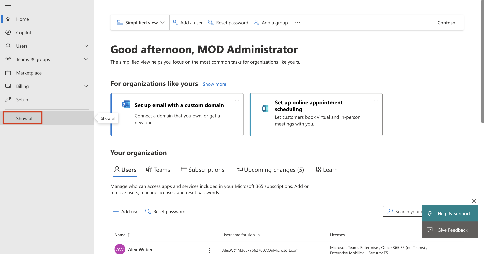
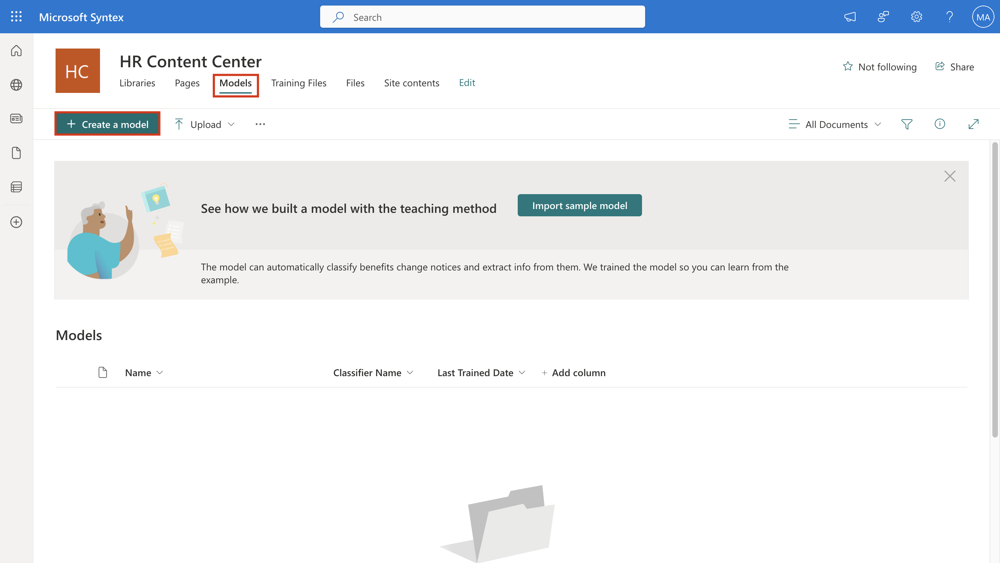
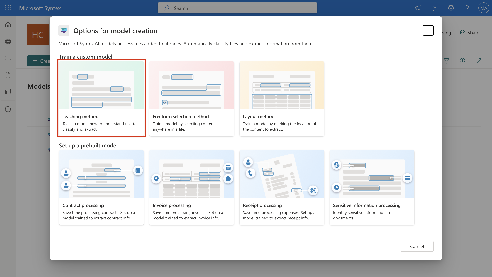
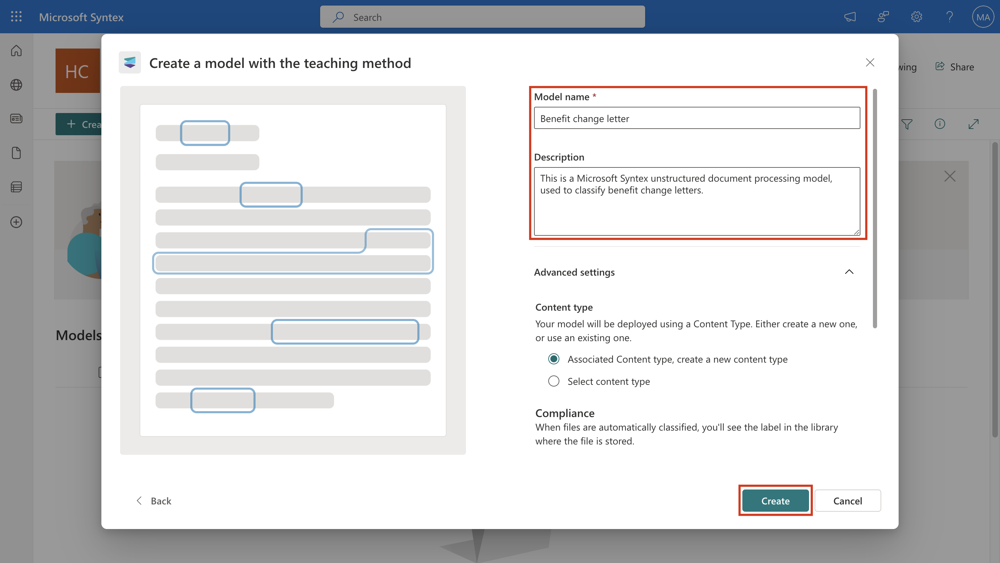
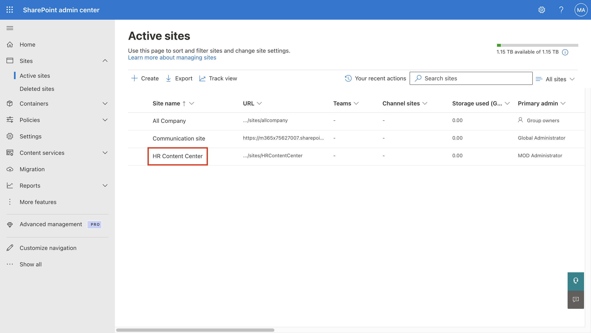
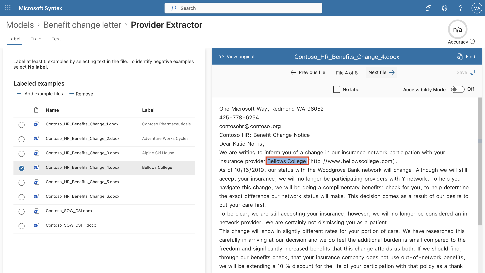
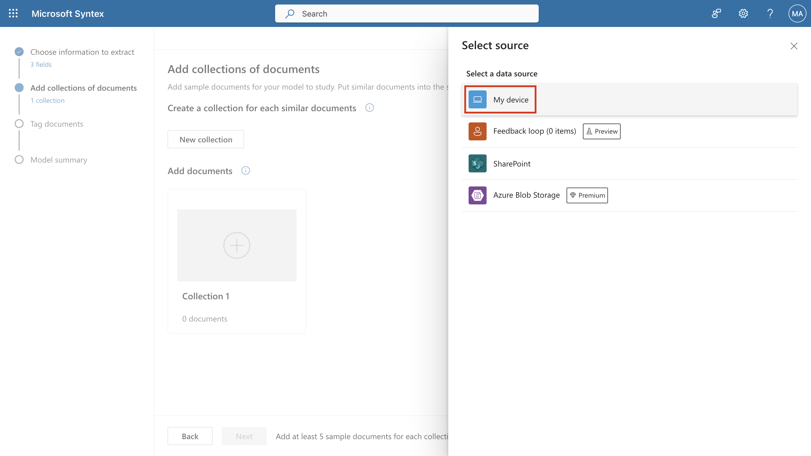
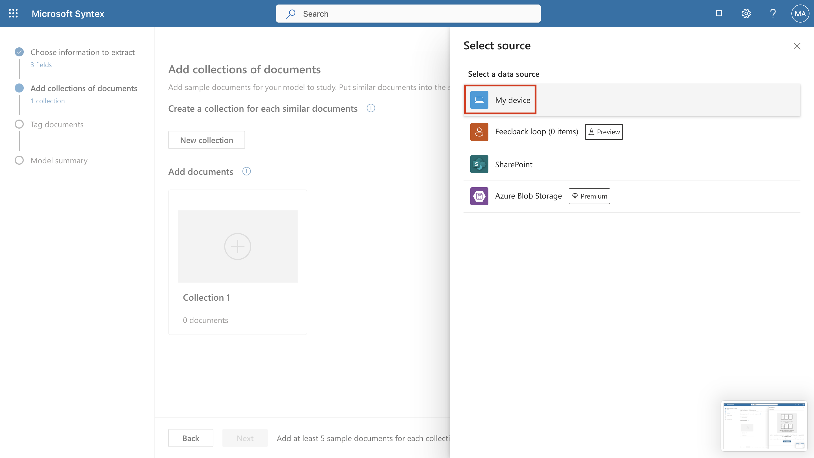

# Lab 1: Introduction to Microsoft Syntex and working with Custom Syntex Models

### Exercise 1: Create a Content Center

To create a new content center:

1.  Open a new tab and navigate to
    \`\`\`https://admin.microsoft.com/\`\`\`, and log in using the
    administrator credentials if not already open.

2.  From the left navigation, select **Show all**.

> 

3.  Select **SharePoint** under **Admin centers**.

> 

4.  Close the Welcome pop-up. From the left navigation, select **Sites**
    \> **Active sites**. On the **Active sites** page,
    select **Create**.

> 

5.  Then select **Browse more sites**.

> 

6.  On the **Choose a template** menu, select **Content cente**r.

7.  For the new site, provide the following information

    - **Site name**: HR Content Center

    - **Primary administrator**: MOD Administrator

8.  Then select **Next**.

> 

9.  Select **English** as the Language and **(UTC-08:00) Pacific Time
    (US and Canada)** as Time zone. Then select **Create site**.

> 

10. Stay on the Active sites page and move on to the next task.

After you create a content center site, you'll see it listed on **Active
sites** in the SharePoint admin center.

## Exercise 2: Use the Teaching method to create an [unstructured document processing model](https://learn.microsoft.com/en-us/microsoft-365/syntex/document-understanding-overview).

#### Task 1: Create the model

1.  Select the newly created **HR Content Center**. And select **Site
    address**.

> 

2.  You will be redirected to the site home page.

> 

3.  From the **Models** library, select **Create a model**.

> 

1.  Select **Teaching method**.

> 

2.  On the **Teaching method: Details** page, you'll find more
    information about the model. Select **Next**.

> 

3.  On the right panel of the **Create a model with the teaching
    method** page, enter the following information.

    - **Model name** – \`\`\`Benefit change letter\`\`\`

    - **Description** – \`\`\`This is a Microsoft Syntex unstructured
      document processing model, used to classify benefit change
      letters.\`\`\`

    - Click dropdown icon for **Advanced settings** and select
      **Associated Content type, create a new content type**.

> 

4.  Scroll down and select **Confidential\\ Trusted People** under
    **Sensitivity Labels** from dropdown menu. Click **Create**.

> 

5.  You will be navigated to **Models** \> **Benefit Change Letter**
    page. Click **x** icon, on **Train a model to classify a type of
    file** pane.

> 

Stay on the same page and continue to the next task.

### Task 2: Train the model

#### Step 1: Classify files as Negative or Positive

1.  If you closed the tab in the previous task, on the Lab VM, open a
    new browser tab and sign in to
    \`\`\`https://admin.microsoft.com/\`\`\`. Log in using the admin
    credentials.

&nbsp;

6.  In **Microsoft 365 admin center**, select **SharePoint** under
    **Admin centers** from left navigation menu.

7.  In **SharePoint admin center**, select **Active sites** from left
    navigation menu. On **Active Sites** page, select **HR Content
    Center** and select **URL** on **HR Content Center** pane.

> 

8.  You’ll be navigated to the SharePoint **HR Content Center** site on
    another tab. Click **Models** and then click **Benefit change
    letter.classifier** under **Models.**

> 

9.  On **Models** \> **Benefit change letter** pane, select **Add
    files** in **Add example files** section.

> 

10. On **Select example files for your model** pane, select **Upload**.
    Navigate to **C:\\Labfiles\Benefit Change Letter** and select all
    the files then click **Open**. ­­

> 

11. On **Select example files for your model** pane, click check box
    next to newly added files only and click **Add**.

> 

12. You will be navigated back to **Models** \> **Benefit change
    letter** pane, click **Train classifier** under **Classify files and
    run training** section.

> 

13. Select the first file and click **Yes**. The first file will be
    labelled as **Positive.** Select the second file and click **Yes**.
    Repeat the same steps and click **Yes** for the first six files.

> 

14. First six files will be labelled as **Positive**. Select **Contoso
    \_SOW_CSI.docx** and **Contoso_SWO_CSI_1.docx** and click **No** for
    both files. Both files will be labelled as **Negative.**

> 

Stay on the same page for next task.

#### Step 2: Create an explanation

1.  Click **Train** tab next to **Label**. Click **New** and **Blank**
    on **Explanations** dialog box.

> 

15. On **Create an explanation** pane, click **Save** after entering the
    following:

- **Name**: \`\`\`Subject\`\`\`

- **Explanation**: Phrase list

- **Type here box**: \`\`\`Benefit Change Notice\`\`\`

> 

Stay on the same page for next task.

#### Step 3: Create an extractor

1.  Click **Benefit change letter** on the top to return to Benefit
    change letter pane.

> 

2.  Click **Create extractor** under **Create and train extractors**.

> 

3.  **New entity extractor** pane will open on the right. On **New
    entity extractor** pane, enter \`\`\`Provider\`\`\` for **Name** and
    click **Create**.

> 

4.  **Provider Extractor** page will open. For first file, select
    **Contoso Pharmaceuticals** using cursor and click **Next file**.

> 

5.  On **Provider Extractor** page for second file, select **Adventure
    Works Cycles** using cursor and click **Next file**.

> 

6.  On **Provider Extractor** page for third file, select **Alpine Ski
    House** using cursor and click **Next file**.

> 

7.  On **Provider Extractor** page for fourth file, select **Bellows
    College** using cursor and click **Next file**.

> 

8.  On **Provider Extractor** page for fifth file, select **Best For You
    Organics Company** using cursor and click **Next file**.

> 

9.  On **Provider Extractor** page for sixth file, select **Contoso,
    Ltd.** using cursor and click **Next file**.

> 

10. On **Provider Extractor** page for **Contoso_SOW_CSI.docx** and
    click the check box for **No label**. Click **Next file**.

> 

11. On **Provider Extractor** page for **Contoso_SOW_CSI_1.docx** and
    click the check box for **No label**. Click **Save.**

> 

Stay on the same page for next task.

#### Step 4: Add an explanation

1.  Click **Train** tab next to **Label**. Click **New** and **Blank**
    on **Explanations** dialog box.

> 

12. On **Create an explanation** pane, enter the following:

- **Name**: \`\`\`Provider\`\`\`

- **Explanation**: Phrase list

- **Type here**: \`\`\`Your insurance provider\`\`\`

- Click **Save and train**.

> 

16. Under **Trained files – Remove**, on **Evaluation** tab, you will
    see **Match** or **Mismatch** for the files.

> 

17. Under Explanation, select lick **New** and then click **Blank**.

> 

18. On **Create an explanation** pane, enter the following:

- **Name**: \`\`\`Text after\`\`\`

- Explanation **type**: **Phrase list**

- Type **here**: \`\`\`(http://\`\`\`

- Click **Save and train.**

> 

19. The **Execution** tab will now show **Match** for all the files.

> 

Here we created the explanations to clarify the name of the insurance
provider for our model. Stay on the same page and continue to the next
step.

### Task 3: Apply a model to a SharePoint library

1.  Click **Benefit change letter** on the top to return to Benefit
    change letter pane.

&nbsp;

20. Click **Apply model** under **Apply model to libraries**.

> 

21. On **Apply Benefit change letter** pane, click **HR Content Center**
    under **Frequent sites**.

22. Click **Files** below **HR Content Center**.

> 

23. Click **Add** on **Apply Benefit change letter** pane.

> 
>
> 

24. Click **Go to library** on **Apply Benefit change letter** pane.

> 

25. Click **Upload** and click **Files**. **Benefit change letter**
    model will be visible in the upper right navigation pane.

> 

26. Go to **C:\\Labfiles\Benefit Change Letter** and select all the
    files then click **Open**.

27. Once processing is complete then columns named **Content type**,
    **Provider** and **Sensitivity** will be visible.

> 

28. Click **Files** tab, column named **Model URL** and **Confidence
    Score** will be visible.

> 

Congratulations! You've created a document understanding model that
classifies files and extracts data. You've also applied that model to a
document library and had each file analyzed. It will take some time for
the model to analyze your files. You can come back later to the HR
Content Center site to see the information filled up in the columns.

## Exercise 3: Use the Freeform selection method to create a [freeform document processing model](https://learn.microsoft.com/en-us/microsoft-365/syntex/form-processing-overview)

### Task 1: Create, Train and Test a form processing model 

1.  If you closed the tab in the previous task, on the Lab VM, open a
    new browser tab and sign in to
    \`\`\`https://admin.microsoft.com/\`\`\`. Log in using the admin
    credentials.

&nbsp;

29. In **Microsoft 365 admin center**, select **SharePoint** under
    **Admin centers** from left navigation menu.

30. In **SharePoint admin center**, select **Active sites** from left
    navigation menu. On **Active Sites** page, select **HR Content
    Center** and select **URL** on **HR Content Center** pane.

31. You’ll be navigated to the SharePoint **HR Content Center** site on
    another tab. Click **Site contents** and click **+New** then click
    **Document Library**.

> 

32. On **Create document library** pane, enter \`\`\`Purchase
    Orders\`\`\` for **Name**. Then select **Create**.

> 

33. Click **Purchase Orders** and click **Upload** \> **Files**.

> 

34. Go to **C:\\Labfiles\Purchase Orders** and select all the files then
    click **Open**.

35. On the **Models** tab, select **Create a model**.

> 

36. Click **Freeform selection method** on **Options for model
    creation** pane.

> 

37. Click **Next** on **Freeform selection method: Details** pane.

> 

38. Enter \`\`\`Purchase Order\`\`\` for **Name** and click **Create**
    on **Create a model with the freeform selection method** pane. The
    environment can take some time to get ready.

> 

39. Click **Add** on **Choose information to extract** pane and click
    **Text Field** on **Add** pane then click **Next.**

> 

40. On **Text Field** dialog, enter \`\`\`PO-number\`\`\` for **Name**
    and click **Done**.

> 

41. Click **Add** on **Choose information to extract** pane and click
    **Text Field** on **Add** pane then click **Next.** On **Text
    Field** dialog, enter \`\`\`Vendor Name\`\`\` for **Name** and click
    **Done**.

> 

42. Click **Add** on **Choose information to extract** pane and click
    **Number Field** on **Add** pane then click **Next.** On **Number
    Field** dialog, enter \`\`\`PO-Total\`\`\` for **Name**, under
    **Format** select **Use comma as decimal separator**, and click
    **Done**.

> 

43. Click **Next** on **Choose information to extract** pane.

> 

44. Click **New collection** on **Add collections of documents** pane.

> 

45. Click **+**icon on **Collection 1** box under **Add documents**.

> 

46. Click **Add documents** on **Collection 1** pane.

> 

47. Click **My device** on **Select source** pane.

> 

48. Go to **C:\\Labfiles\Purchase Order** and select all the 7 PDF files
    and click **Open**.

49. Click **Upload 7 documents** on **Upload documents** pane.

> 

50. Click **Done** on **Upload documents** pane, once it notifies that
    **Successfully uploaded 7 of 7 documents**.

51. Click **Next** on **Add collections of documents** pane.

> 

52. Click **document 1** and place the cursor in **PO \#** box and
    select PO then click **PO-number.**

> 

53. Place the cursor under **Vendor** and select **Pradeep Gupta** then
    click **Vendor Name**.

> 

54. Scroll down and place the cursor on **Total amount** box and select
    the amount and click **PO-Total.**

> 

55. On **Collection 1** pane on right, the fields will have green checks
    as you have selected **PO-number, Vendor Name** and **PO-Total**.
    Click **document 2.**

56. Place the cursor on **PO#** box and select PO then click
    **PO-number**. Place the cursor on **Pradeep Gupta** under
    **Vendor** and click **Vendor Name** then place the cursor on
    **Total amount** and click **PO-Total**. Click **document 3**.
    Repeat the same steps for document 3, 4 and 5. Make sure all the
    first five documents are **Purchase Order** documents.

57. Click **document 6** and place the cursor in **TRADE#** box and
    select Trade number then click **PO-number**.

58. Click three dots on **Vendor Name** and **PO-Total** and click **Not
    available in document**.

> 

59. Click document 7 and place the cursor in **TRADE#** box and select
    the Trade number and click **PO-number** then click three dots on
    **Vendor Name** and **PO-Total** and select **Not available for
    document**. The check box for Vendor Name and PO-Total for document
    6 and 7 will be greyed out.

> 

60. Click **Next**.

> 

61. Click **Train** on **Model summary** page.

> 

62. Click **Go to models** on **Your model is training** pane.

> 

Note: It may take some time for training to complete. To save time, you
may carry on with the next exercise and return back to complete the next
task.

### Task 2: Apply a form processing model to a library

1.  On the Lab VM, open a new browser tab and sign in to
    \`\`\`https://admin.microsoft.com/\`\`\`. On **Pick an account**
    prompt, click the tenant email id provided to you for the lab.

&nbsp;

63. On **Active Sites** page, click **HR Content Center** and click
    **URL** on **HR Content Center** pane.

64. You’ll be navigated to the SharePoint **HR Content Center** site on
    another tab. Click **Models** and click **Purchase
    Orders.classifier**.

> 

65. Click **Review** once the model is trained.

> 

66. Click **Publish** on **Training document** section.

> 

67. Click **HR Content Center** \> **Purchase Order** and click **Add**
    on **Apply Trade Confirmation** pane.

> 

68. Click **Go to library**.

> 

69. You will be navigated to **HR Content Center**. Select all the PDF
    files and click **Classify and extract**.

> 

70. All the columns will be visible once analyzing is complete. It may
    take some time for columns to be filled with data.

> 

Congratulations! You have successfully created a form processing model
and applied it to a library.

## Exercise 4: Use the Layout method to create a [structured document processing model](https://learn.microsoft.com/en-us/microsoft-365/syntex/form-processing-overview)

### Task 1: Create a structured document

1.  If you closed the tab in the previous task, on the Lab VM, open a
    new browser tab and sign in to
    \`\`\`https://admin.microsoft.com/\`\`\`. Log in using the admin
    credentials.

&nbsp;

71. In **Microsoft 365 admin center**, select **SharePoint** under
    **Admin centers** from left navigation menu.

72. In **SharePoint admin center**, select **Active sites** from left
    navigation menu. On **Active Sites** page, select **HR Content
    Center** and select **URL** on **HR Content Center** pane.

73. You’ll be navigated to the SharePoint **HR Content Center** site on
    another tab. Click **Site contents** and click **+New** then click
    **Document Library**.

> 

74. On **Create document library** pane, enter \`\`\`Trade
    Confirmation\`\`\` for **Name**.

> 

75. Click **Trade Confirmations** and click **Upload** \> **Files**.

> 

76. Go to **C:\\Labfiles\Trade Confirmations** and select all the files
    then click **Open**.

77. On the **Models** tab, select **Create a model**.

78. Click **Layout method** on **Options for model creation** pane.

> 

79. On the **Layout method: Details** page, you'll find more information
    about the model. Select **Next**.

> 

80. On the right panel of the **Create a model with the layout
    method** page, enter the following information. Then select
    **Create**.

    - **Model name** – \`\`\`Trade Confirmation\`\`\`

> 

81. Click **Add** on **Choose information to extract** pane and click
    **Text Field** on **Add** pane then click **Next.** On **Text
    Field** dialog, enter \`\`\`Reference\`\`\` for **Name** and click
    **Done**.

> 

82. Click **Add** on **Choose information to extract** pane and click
    **Text Field** on **Add** pane then click **Next**.

> 

83. On **Text Field** dialog, enter \`\`\`Customer\`\`\` for **Name**
    and click **Done**.

> 

84. Click **Add** on **Choose information to extract** pane and click
    **Number Field** on **Add** pane then click **Next.**

> 

85. On **Number Field** dialog, enter \`\`\`Total\`\`\` for **Name**,
    under **Format** select **Use comma as decimal separator**, and
    click **Done**.

> 

86. Click **Next** on **Choose information to extract** pane.

> 

87. Click **New collection** on **Add collections of documents** pane.

> 

88. Click **+**icon on **Collection 1** box under **Add documents**.

> 

89. Click **Add documents** on **Collection 1** pane.

> 

90. Click **My device** on **Select source** pane.

> 

91. Go to **C:\\Labfiles\Trade Confirmation** and select 5 of the PDF
    files and click **Open**.

92. Click **Upload 5 documents** on **Upload documents** pane.

> 

93. Click **Done** on **Upload documents** pane, once it notifies that
    **Successfully uploaded 5 of 5 documents**.

> 

94. Click **Next** on **Add collections of documents** pane.

> 

95. Click **document 1** and place the cursor in **Trade#** box and
    select **Trade** then click **Reference**.

> 

96. Place the cursor under **Customer** and select **Allan Deyoung**
    then click **Customer**. Scroll down and place the cursor on
    **Total** box and select the amount and click **Total.**

> 

97. On **Collection 1** pane on right, the fields will have green checks
    as you have selected **Trade**, **Customer** and **Total**. Do this
    for all the 5 documents**.**

> 

98. Click **Next.**

> 

99. Click **Train** on **Model summary** page.

> 

100. Click **Go to details** on **Your model is training** pane.

> 

Note: It may take some time for training to complete. To save time, you
may carry on with the next exercise and return back to complete the next
task.

### Task 2: Apply a form processing model to a library

1.  On the Lab VM, open a new browser tab and sign in to
    \`\`\`https://admin.microsoft.com/\`\`\`. On **Pick an account**
    prompt, click the tenant email id provided to you for the lab.

&nbsp;

101. On **Active Sites** page, click **HR Content Center** and click
     **URL** on **HR Content Center** pane.

102. You’ll be navigated to the SharePoint **HR Content Center** site on
     another tab. Click **Models** and click **Trade
     Confirmation:Classifier**.

> 

103. Click **Review** once the model is trained.

> 

104. Click **Publish** on **Accuracy score** section.

> 

105. On the **Models** \> **Overview** page, select **Apply**.

> 

106. Click **HR Content Center** \> **Trade Confirmation** and click
     **Add** on **Apply Trade Confirmation** pane.

> 

107. Click **Go to library**.

108. You will be navigated to **HR Content Center**. Select all the PDF
     files and click **Classify and extract**.

> 

109. All the columns will be visible once analyzing is complete. It may
     take some time for columns to be filled with data.

Congratulations! You have successfully created a form processing model
and applied it to a library.
