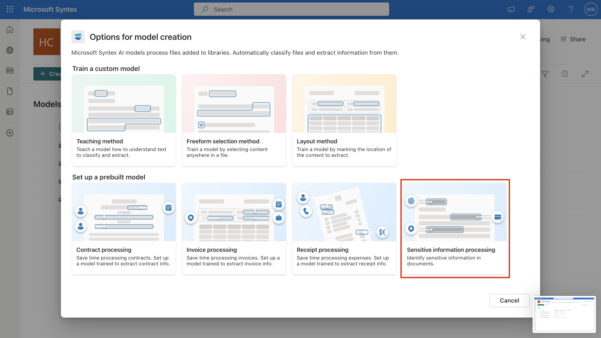
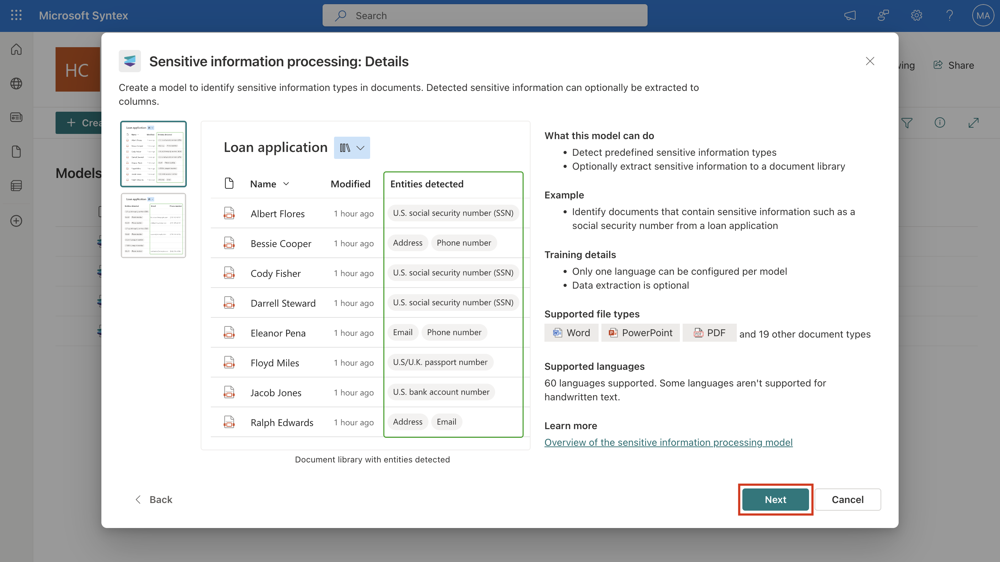
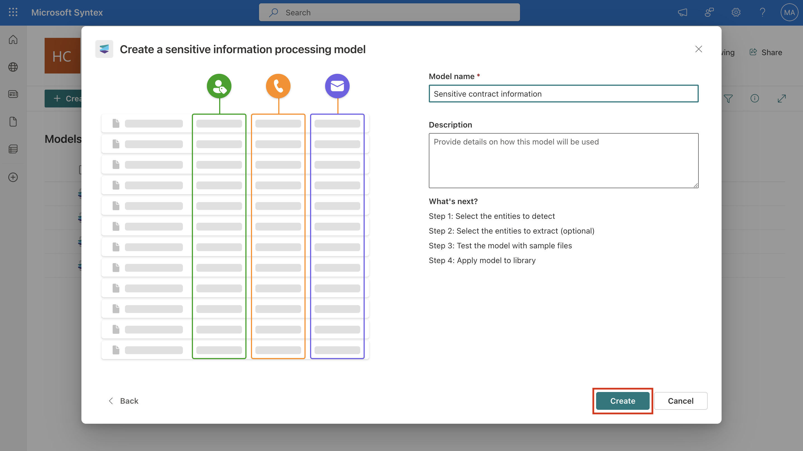
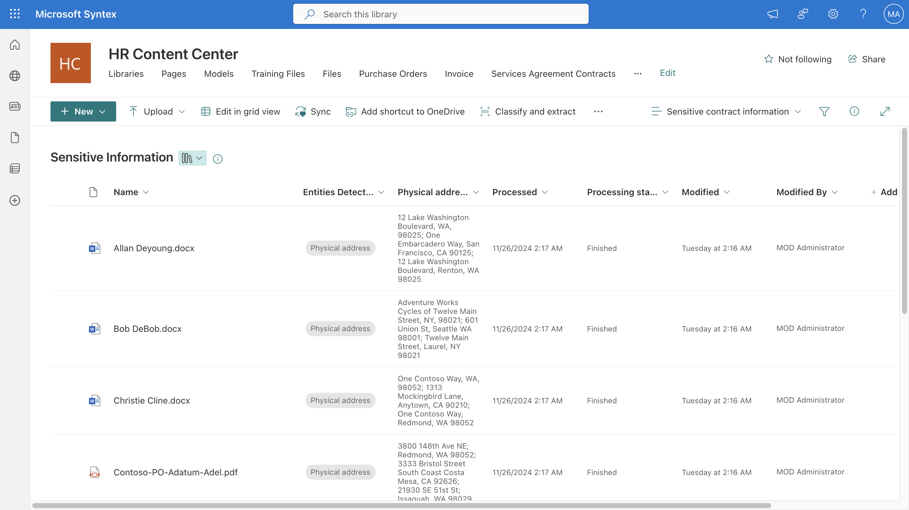

# Lab 2: Exploring Prebuilt Models

## Exercise 1: Working with Contracts Model

### Task 1: Create a contracts model

1.  If you closed the tab in the previous task, on the Lab VM, open a
    new browser tab and sign in to
    ```https://admin.microsoft.com/```. Log in using the admin
    credentials. In **Microsoft 365 admin center**, select **SharePoint** under
    **Admin centers** from left navigation menu.

2.  In **SharePoint admin center**, select **Active sites** from left
    navigation menu. On **Active Sites** page, select **HR Content
    Center** and select **URL** on **HR Content Center** pane.

3.  You’ll be navigated to the SharePoint **HR Content Center** site on
    another tab. Click **+New** and click **Document library**.

> 

4.  On **Create document library** pane, enter ```Services Agreement
    Contracts``` for **Name** and click **Create**.

> 

5.  Click **Models**. Click **Create a model** on the top left of **HR
    Content Center** page.

6.  Click **Contract processing** on **Options for model creation**
    pane.

> 

7.  Click **Next** on **Contract processing: Details** pane.

> 

8.  On **Create a contract processing model** pane, enter ```Service
    Agreements``` for **Name** and click **Create**.

Stay on the same page and continue to the next task

### Task 2: Upload an example file to analyze

1.  Click **Add a file** under **Add a file to analyze** on **Model** \>
    **Service Agreements** page.

> 

2.  Click **+Add** on **Files to analyze with the model** pane.

> 

3.  Click **Upload** and then click **Files** on **Add a file from the
    training files library** dialog.

> 

4.  Go to **c:\Labfiles\Service Agreement Contracts** and select **Allan
    Deyoung.pdf** then click **Open**. Click check box next to **Allan
    Deyoung.pdf** on **Add a file from the training files library** pane
    and click **Add**.

> 

5.  Click **Next** on **Files to analyze with the model** pane.

### Task 3: Select extractors for your model

1.  On **View extractor details** page, on **Contracts extractors**
    pane, click check box next to **ContracTitle** and click **Yes** on
    **Select extractor?** dialog.

> 

2.  Check the selection and mark yes for all the extractors.

> 

Stay on the same page for next exercise.

### Task 4: Apply the model

1.  Click **Apply model** and on **Apply Model to library** pane, click
    **HR Content Center.**

> 

2.  Click **Service Agreement Contracts** on **Apply Office expenses to
    library** pane under **Choose the library you would like to add**
    **this model to** section. Once **Service Agreement Contracts** is
    selected, click **Add**.

> 

3.  On **Apply Office expenses to library** pane, click **Go to
    library**.

> 

4.  In **Service Agreement Contracts** document Library, click
    **Upload** and then click **Files**. Go to **c:\Labfiles\Service
    Agreement Contracts** and select all files then click **Open**. ­

5.  You will see all the fields listed as the **Columns**. Once the
    processing is complete, the columns will be filled. You might have
    to refresh the page to see the changes after uploading the file.

> 

## Exercise 2: Working with Invoices Model

### Task 1: Create a prebuilt invoices model

1.  If you closed the tab in the previous task, on the Lab VM, open a
    new browser tab and sign in to
    ```https://admin.microsoft.com/```. Log in using the admin
    credentials.

2.  In **Microsoft 365 admin center**, select **SharePoint** under
    **Admin centers** from left navigation menu.

3. In **SharePoint admin center**, select **Active sites** from left
    navigation menu. On **Active Sites** page, select **HR Content
    Center** and select **URL** on **HR Content Center** pane.

4. You’ll be navigated to the SharePoint **HR Content Center** site on
    another tab. Click **+New** and click **Document library**.

> 

5. On **Create document library** pane, enter ```Invoice``` for
    **Name** and click **Create**.

> 

6. Click **Models**. Click **Create a model** on the top left of **HR
    Content Center** page. Click **Invoice processing** on **Options for
    model creation** pane.

> 

7. Click **Next** on **Invoice processing: Details** pane.

> 

8. On **Create an invoice processing model** pane, enter ```Office
    expenses``` for **Name** and click **Create**.

> 

Stay on the same page and continue to the next task

### Task 2: Upload an example file to analyze

1.  Click **Add a file** under **Add a file to analyze** on **Model** \>
    **Office expenses** page.

> 

2.  Click **+Add** on **Files to analyze with the model** pane.

> 

3.  Click **Upload** and then click **Files** on **Add a file from the
    training files library** dialog.

> 

4.  Go to **c:\Labfiles** and select **Sample Invoice.pdf** then click
    **Open**. Click check box next to **sample-invoice.pdf** on **Add a
    file from the training files library** pane and click **Add**.

> 

5.  Click **Next** on **Files to analyze with the model** pane.

> 

Stay on the same page for next exercise.

### Task 3: Select extractors for your model

1.  On **View extractor details** page, on **Invoice extractors** pane,
    click check box next to **AmountDue** and click **Yes** on **Select
    extractor?** dialog.

> 

2.  Click the check box for **BillingAddress** on **Invoice extractors**
    pane and click **Yes** on **Select extractor?** dialog.

3.  Scroll **down** on **Invoice extractors** pane and in the same way
    click the check box for **CustomerId, CustomerName, DueDate,
    InvoiceDate, InvoiceID, InvoiceTotal, PreviousUnpaidBalance** and
    **PurchaseOrder** and click **Yes** on **Select extractor?** dialog,
    if prompted.

> 

4.  Select **Next**.

Stay on the same page for next exercise.

### Task 4: Apply the model

1.  Click **Apply model** and on **Apply Model to library** pane, click
    **HR Content Center.**

> 

2.  Click **Invoices** on **Apply Office expenses to library** pane
    under **Choose the library you would like to add** **this model to**
    section.

> 

3.  Select **Invoices**.

> 

4.  Once **Invoices** is selected, click **Add**.

> 

5.  On **Apply Office expenses to library** pane, click **Go to
    library**.

> 

6.  In **Invoices** document Library, click **Upload** and then click
    **Files**.

> 

7.  Go to **c:\Labfiles** and **Sample Invoice.pdf** then click
    **Open**. ­

You will see all the fields listed as the **Columns**. Once the
processing is complete, the columns will be filled. You might have to
refresh the page to see the changes after uploading the file.


## Exercise 3: Working with Sensitive information

To create and configure a sensitive information model, follow these
steps:

1.  If you closed the tab in the previous task, on the Lab VM, open a
    new browser tab and sign in to
    ```https://admin.microsoft.com/```. Log in using the admin
    credentials.

2. In **Microsoft 365 admin center**, select **SharePoint** under
    **Admin centers** from left navigation menu.

3. In **SharePoint admin center**, select **Active sites** from left
    navigation menu. On **Active Sites** page, select **HR Content
    Center** and select **URL** on **HR Content Center** pane.

4. You’ll be navigated to the SharePoint **HR Content Center** site on
    another tab. Click **+New** and click **Document library**. On
    **Create document library** pane, enter ```Sensitive
    Information``` for **Name** and click **Create**.

> 

5. Click **Models**. Click **Create a model** on the top left of **HR
    Content Center** page.

6. Click **Sensitive information processing** on **Options for model
    creation** pane.

> 

7. Click **Next** on **Sensitive information processing: Details**
    pane.

> 

8. On **Create a Sensitive information processing** **model** pane,
    enter ```Sensitive contract information``` for **Name** and
    click **Create**.

> 

9. You will be redirected to the models home page. From the **Add
    entities to detect card**, select **Add entities**.

> 

10. On the **Configure detection** page:

    - Select **English** as the language.

    - From the list of supported entities, search for and Select
      **Physical Address**.

    - Then select **Next**.

> 

11. On the **Configure extraction** page, you see the list of sensitive
    information entities you chose to detect. Select **Physical
    Address**, and then select **Next**.

> 

12. On the **Test model** page, you test the model to make sure it
    detects and extracts the entities you want. Select **+Add files** \>
    **Upload** \> **Files**. From **c:\Labfiles\Contracts Management**,
    select **Test file.docx**.

> 

13. Select **Test file.docx** and then click **Add**. Then select
    **Next**.

> 

14. On the **Apply model** page, select **+Add library**, and choose
    **HR Content Center** \> **Sensitive information**, and then
    select **Add**.

> 

15. Select **Go to library**.

16. Select **Upload** \> **Files**. Select all the files in
    **c:\Labfiles\Contracts Management** then select **Open**.

You will see all the fields listed as the **Columns**. Once the
processing is complete, the columns will be filled. You might have to
refresh the page to see the changes after uploading the file.

> 
