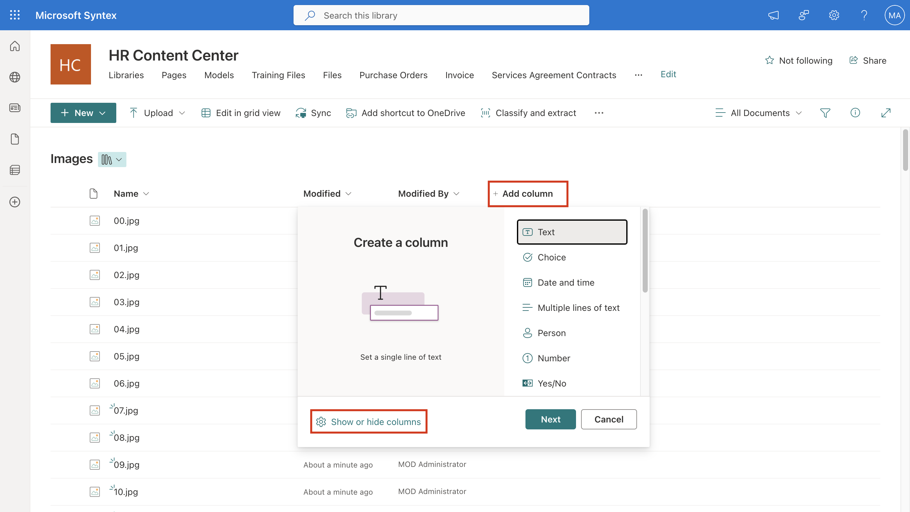
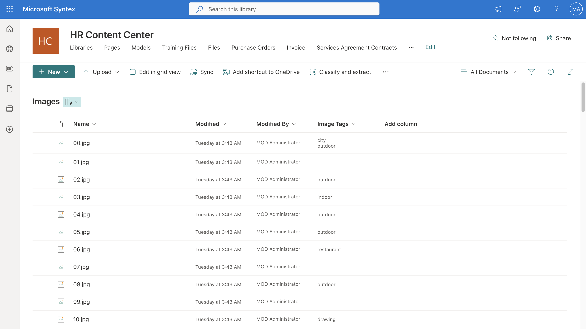
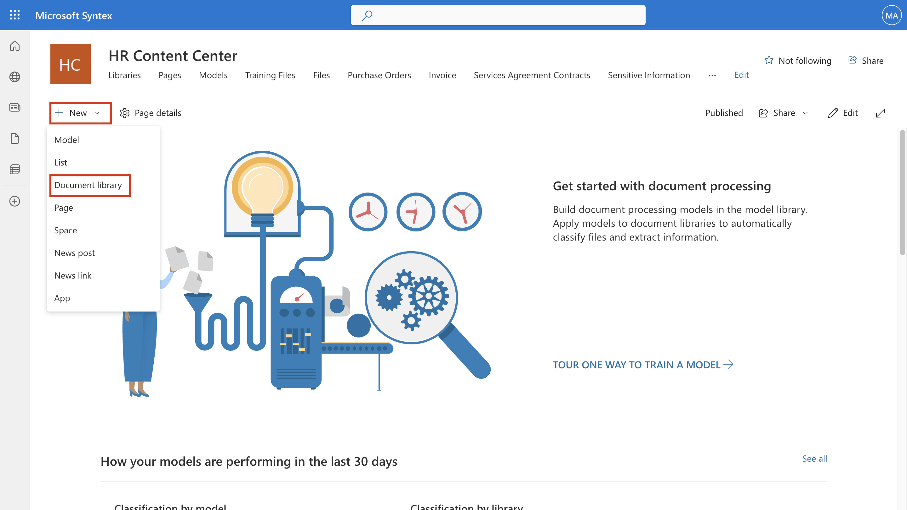
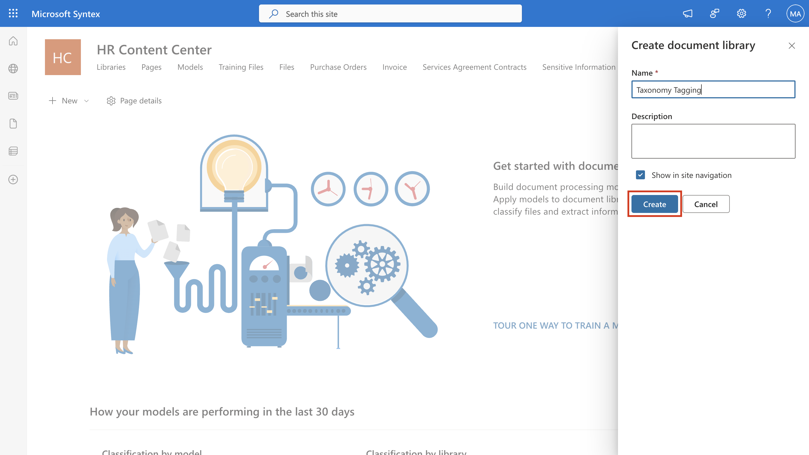
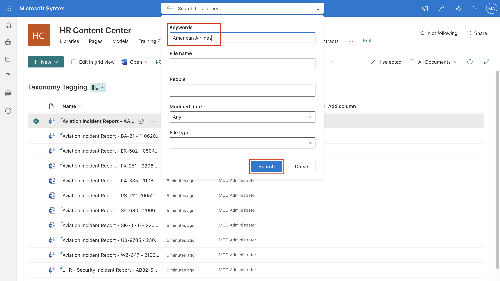

# Lab 3: Content Discovery and Management

## Exercise 1: Finding and Managing Images

Use these steps to enable enhanced image tagging:

1.  on the Lab VM, open a new browser tab and sign in to
    ```https://admin.microsoft.com/```. Log in using the admin
    credentials. In **Microsoft 365 admin center**, select **SharePoint** under
    **Admin centers** from left navigation menu.

2.  In **SharePoint admin center**, select **Active sites** from left
    navigation menu. On **Active Sites** page, select **HR Content
    Center** and select **URL** on **HR Content Center** pane.

3.  You’ll be navigated to the SharePoint **HR Content Center** site on
    another tab. Click **+New** and click **Document library**.

> 

4.  On **Create document library** pane, enter ```Images``` for
    **Name** and click **Create**.

> 

5.  Select **Upload** \> **Files**. Upload the images in
    **c:\Labfiles\Images**.

6.  Once uploaded select, the three dots in the command bar and then
    select **Automate** \> **Configure image tagger**.

> 

7.  On the confirmation prompt, select **Enable**.

> 

8.  Select **Add column** \> **Show or hide columns**.

> 

9.  Select **Image tags** column and select **Apply**.

> 

10. Images uploaded are tagged with a set of descriptive keywords. The
    keywords are available in the **Image Tags** column that is added to
    the library view.

> 

## Exercise 2: Taxonomy Tagging

1.  on the Lab VM, open a new browser tab and sign in to
    ```https://admin.microsoft.com/```. Log in using the admin
    credentials. In **Microsoft 365 admin center**, select **SharePoint** under
    **Admin centers** from left navigation menu.

2. In **SharePoint admin center**, select **Active sites** from left
    navigation menu. On **Active Sites** page, select **HR Content
    Center** and select **URL** on **HR Content Center** pane.

3. You’ll be navigated to the SharePoint **HR Content Center** site on
    another tab. Click **+New** and click **Document library**.

> 

4. On **Create document library** pane, enter ```Taxonomy
    Tagging``` for **Name** and click **Create**.

> 

5. Select **Upload** \> **Files**. Upload the images in
    **c:\Labfiles\Aviation Incident Reports**.

> 

6. You will be redirected to the library. Scroll to the right and
    select **Add column** \> **Managed metadata**.

> 

7. Name the column as **Location**. Under **Term set or term**, select
    **Location** under **People**. Then select **Save**.

> 

8. Select **Save** again on the **Create column panel**.

> 

9. Once the taxonomy column is created, any new documents uploaded or
    existing documents edited in the library are processed to tag the
    configured term set or term. It might take some time to show up.

Stay on the same page and continue to the next exercise.

## Exercise 3: Finding Content Details

1.  on the Lab VM, open a new browser tab and sign in to
    ```https://admin.microsoft.com/```. Log in using the admin
    credentials.

2. In **Microsoft 365 admin center**, select **SharePoint** under
    **Admin centers** from left navigation menu.

3. In **SharePoint admin center**, select **Active sites** from left
    navigation menu. On **Active Sites** page, select **HR Content
    Center** and select **URL** on **HR Content Center** pane.

4. You’ll be navigated to the SharePoint **HR Content Center** site on
    another tab.

5. Select the **Taxonomy tagging** library.

6. In the **Search this library** box, select the content query icon.

> 

7. In the content query pane, type the text or select the parameter you
    want to find in one or more of the search fields.

8. In the keywords field, Type **American Airlines**. Than
    select **Search**. The documents that match your metadata query are
    shown on the results page.

> 

Congratulations! You have successfully looked into the use of content
discovery features of Microsoft Syntex.