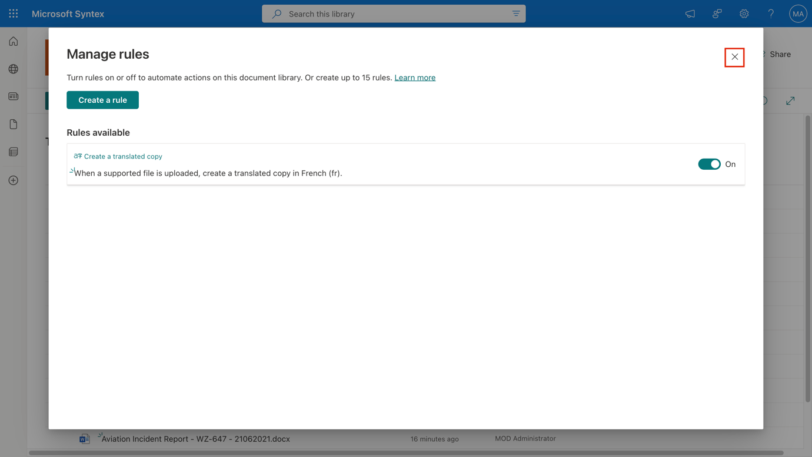
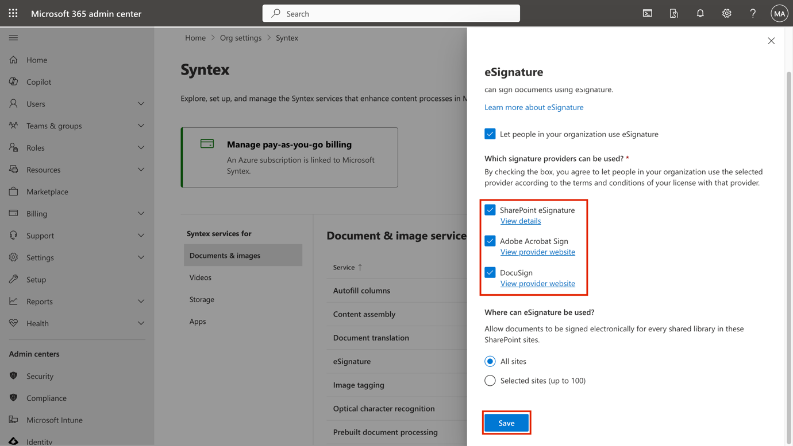
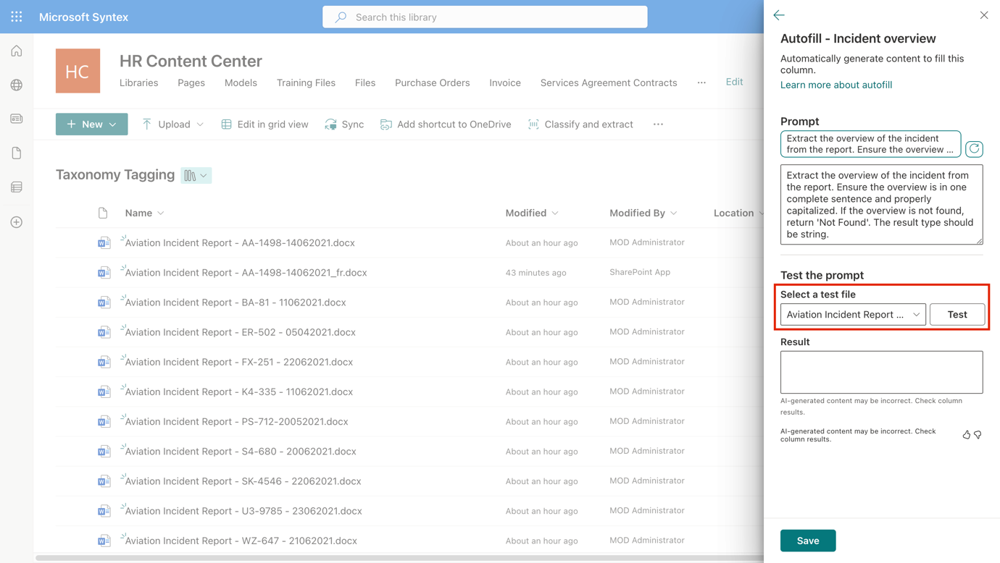

# Lab 4: Advanced Syntex Features

## Exercise 1: Document Translation

### Task 1: Translate a document on demand

1.  On the Lab VM, open a new browser tab and sign in to
    ```https://admin.microsoft.com/```. Log in using the admin
    credentials. In **Microsoft 365 admin center**, select **SharePoint** under
    **Admin centers** from left navigation menu.

2.  In **SharePoint admin center**, select **Active sites** from left
    navigation menu. On **Active Sites** page, select **HR Content
    Center** and select **URL** on **HR Content Center** pane.

3.  You’ll be navigated to the SharePoint **HR Content Center** site on
    another tab.

4.  Select the **Taxonomy tagging** library.

5.  Select any one file and then select the three dots in the command
    bar. From the drop down select **Translate**.

> 

6.  In the dialogue box, select the language – **French**. Then select
    **Translate**.

> 

7.  You receive a confirmation message saying that the request to
    translate the file has been submitted.

8.  It can take several minutes for the translated file to be created.
    When the process is completed, the translated file will appear in
    the document library.

> 

### Task 2: Translate a document when a new file is added

To create a rule to translate documents automatically when a document is
created, follow these steps:

1.  On the Lab VM, open a new browser tab and sign in to
    ```https://admin.microsoft.com/```. Log in using the admin
    credentials.

2.  In **Microsoft 365 admin center**, select **SharePoint** under
    **Admin centers** from left navigation menu.

3. In **SharePoint admin center**, select **Active sites** from left
    navigation menu. On **Active Sites** page, select **HR Content
    Center** and select **URL** on **HR Content Center** pane.

4. You’ll be navigated to the SharePoint **HR Content Center** site on
    another tab.

5. Select the **Taxonomy tagging** library.

6.  Select **Automate** \> **Rules** \> **Create a rule**.

> 
>
> 

7.  On the **Create a rule** page, select **A new file is added**.

> 

8.  Under **When a new file is added**, complete the rule statement:

- Select **Choose action**, and then select **create a translated copy
  in**.

> 

- Select **enter a language**, and then enter **French**.

9.  When your rule statement is complete, select **Create**.

> 

10.  Once done close the dialogue box.

> 

11.  Now the new files will be translated automatically.

## Exercise 2: SharePoint eSignature Setup

### Task 1: Set up SharePoint eSignature

1.  Open a new tab and navigate to
    \`\`\`https://admin.microsoft.com/\`\`\`, and log in using the
    administrator credentials. Select **Setup**, and then view
    the **Files and content** section.

2. In the **Files and content section**, select **Use content AI with
    Microsoft Syntex**.

3. Select **Go to Syntex Settings**.

4. On the Syntex page, in the **Document & images** section,
    select **eSignature**.

> 

5. On the **eSignature** panel, select **Let people in your
    organization use eSignature**. Select all the signature providers as
    well.

6. Select **Save**.

> 

7. Select **Turn on**.

> 

### Task 2: Create a signature request

1.  On the Lab VM, open a new browser tab and sign in to
    \`\`\`https://admin.microsoft.com/\`\`\`. Log in using the admin
    credentials.

2. In **Microsoft 365 admin center**, select **SharePoint** under
    **Admin centers** from left navigation menu.

3. In **SharePoint admin center**, select **Active sites** from left
    navigation menu. On **Active Sites** page, select **HR Content
    Center** and select **URL** on **HR Content Center** pane.

4. You’ll be navigated to the SharePoint **HR Content Center** site on
    another tab.

5. Select the **Purchase Orders** library.

6. Open the document for which you want to start the eSignature
    process.

7. In the document viewer, select the pen icon and then **SharePoint
    eSignature**.

> 

8. In the recipients field, add **Allan DeYoung** and **Megan Bowen**.

> 

9. On the **Create a signature request** panel (step 2 of 3), drag and
    drop the **Signature** fields to the appropriate locations in the
    document for each recipient. Each form field can be marked either as
    required or not required.

10. Select **Next** to progress to the next stage. At least one required
    signature field is needed for each recipient. Up to 50 fields
    (total) can be added to the document.

> 

11. On the **Create a signature request** panel (step 3 of 3),
    optionally enter a title for the request, add an optional message,
    and review the details on the panel to make sure it's correct. Then
    select **Send**.

> 

12. Once sent, the status of the request is set to **In progress**. An
    email notification is sent to the creator and the recipients.
    If **Recipients must sign in order** is toggled on, recipients will
    be able to add their signature in the order specified, otherwise
    they can add their signature in any order.

## Exercise 3: Autofill Column

1.  On the Lab VM, open a new browser tab and sign in to
    \`\`\`https://admin.microsoft.com/\`\`\`. Log in using the admin
    credentials.

2. In **Microsoft 365 admin center**, select **SharePoint** under
    **Admin centers** from left navigation menu.

3. In **SharePoint admin center**, select **Active sites** from left
    navigation menu. On **Active Sites** page, select **HR Content
    Center** and select **URL** on **HR Content Center** pane.

4. You’ll be navigated to the SharePoint **HR Content Center** site on
    another tab.

5. Select the **Taxonomy Tagging** library.

6.  In a SharePoint library, select **+Add Column** \> **Text** \>
    **Next**.

> 

7.  On the **Create a column** panel, \`\`\`Incident overview\`\`\`.

8.  In the **Autofill** section, select **Set up**.

> 

9.  On the **Autofill** panel, in the **Prompt** box, create the prompt.
    The prompt identifies the type of information you want to extract
    from a file to a column. For **Text** and **Multiple lines of
    text** only, a suggested prompt is automatically generated. Select
    the **Refresh** button to see a different suggested prompt. Select
    the suggested prompt to add it to the **Prompt** box, and you can
    edit it as needed.

> 

10.  In the **Test the prompt** section, select a file to test the prompt
    using the files in the library. The results display in
    the **Result** box. If needed, you can modify the prompt and retest
    it until you achieve the result you want.

> 

11.  When have the prompt you want, select **Save**.

> 

12.  Again select **save**. The new column displays in the library.

> 

13.  To process existing library content, select the files for which you
    want to apply the autofill column. Then from the command bar,
    select **More options** (**...**) \> **Autofill**.

> 

14. You see a message indicating that autofill is starting to process
    the files and that it might take time to complete processing.

After an autofill setting on a column is saved, any new files uploaded
to the library are automatically processed, and the extracted
information is saved to the corresponding columns.