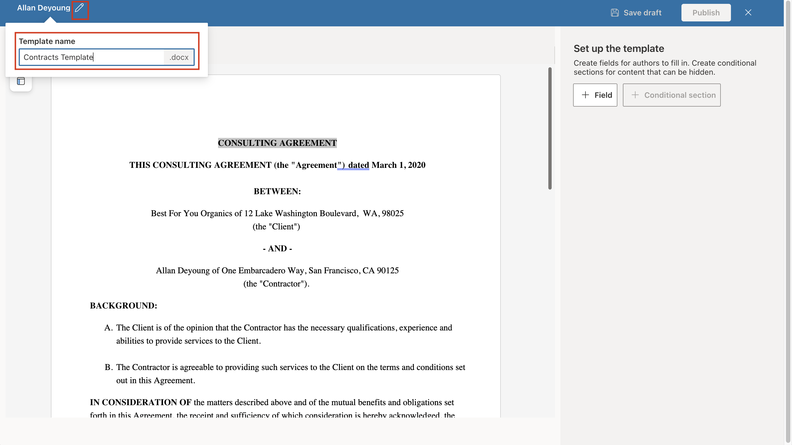
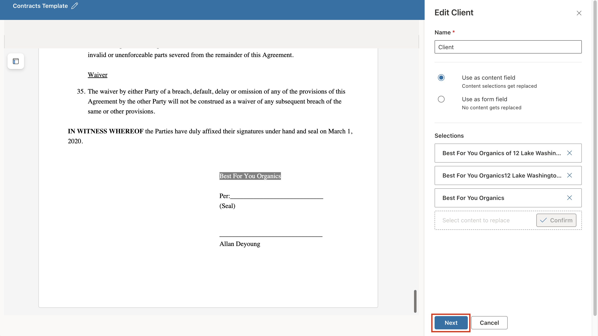

# Lab 5: Document Processing and Automation

## Exercise 1: Create a modern template in Microsoft Syntex

1.  Open a new tab and navigate to
    ```https://admin.microsoft.com/```, and log in using the
    administrator credentials if not already open.

2.  From the left navigation, select **Show all**.

> 

3.  Select **SharePoint** under **Admin centers**.

> 

4.  From the SharePoint admin center, select **HR Content Center** and
    select the link to the site.

> 

5.  On the home page, select **New** \> **Document Library**.

> 

6.  Name it as ```Contracts```. Then select **Create**.

> 

7.  You will be redirected to the document library.
    Select **New** \> **Create modern template**.

> 

8.  Select **Browse this device**. From **c:\Labfiles\Contracts
    Management\\** select **Allan Deyoung.docx** to upload.

> 

9.  After you upload the document, the document is displayed in the
    template studio where you can convert the document to a template by
    adding fields.

10. At the upper-left corner of the template studio, select the name for
    the template. The default name is the name of the document used to
    create the template. To rename the template, select the default name
    or the pencil icon next to the name, type ```Contracts
    Template```, and then select **Enter**.

> 

11. Select the **Field** button. Name it as ```Client```. Then
    select **Use as content field**.

> 

12. On the document select a section of the content “Best For You
    Organics of 12 Lake Washington Boulevard, WA, 98025”, and when it
    appears on the field panel on the right, select **Confirm**.

> 

13. You can select as many occurrences as required. Mark the name of the
    client in section 22 and at the end of the document as well.

> 

14. When the field is created, select **Next** to associate the created
    field with different data sources.

> 

15. In the **How authors fill in this field** section, select **Enter
    text or select a date**.

16. In the **Type of info** field, select **Single line of text**.
    Select **Save**.

> 

17. You can create as many fields as you think are necessary. When
    you're done, you can choose to save the template as a draft.

18. For this document create the following fields.

    - Contractor – Allan Deyoung of One Embarcadero Way, San Francisco,
      CA 90125

    - Currency – US Dollars

> 

19. You can **Save draft** to save the template as a draft and you can
    access it later. Here select **Publish** to publish the template to
    be used by other users in the organization to create documents.

> 

20. On the Publish template pane, select the template fields and then
    select the **Publish** button.

> 

21. Select **Done** once your template is **Published**.

## Exercise 2: Generate documents with the template

1.  Open a new tab and navigate to
    ```https://admin.microsoft.com/```, and log in using the
    administrator credentials if not already open.

2.  From the left navigation, select **Show all**.

> 

3.  Select **SharePoint** under **Admin centers**.

> 

4.  From the SharePoint admin center, select **HR Content Center** and
    select the link to the site.

> 

5.  Select **Libraries** \> **Contents** \> **Contracts**.

> 

6.  Select **New** \> **Contracts template**.

> 

7.  You will see three fields, where you will have to manually enter the
    values.

8.  Enter the following values. Then select **Create Document**.

    - **Client** - ```Adventure Works Cycles of Twelve Main Street,
      NY, 98021```

    - **Contractor** - ```Bob DeBob of 601 Union St, Seattle WA
      98001```

    - **Currency** - ```INR```

> 

9.  Enter ```Bob DeBob``` as the document name.

> 

Congratulations! You have developed a template which you can use for
automatically generate the contracts.
