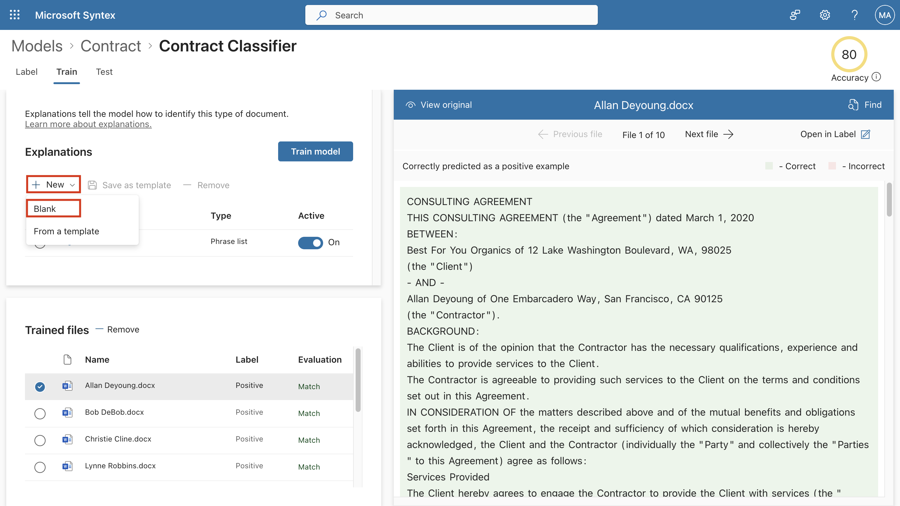

# Lab 6: Contracts Management in Microsoft Syntax

## Exercise 1: Overview of the process

Unstructured document processing models uses artificial intelligence
(AI) to automate classification of files and extraction of information.
These types of models are also optimal in extracting information from
unstructured and semi-structured documents where the information you
need isn't contained in tables or forms, such as contracts.

Unstructured document processing models use optical character
recognition (OCR) technology to scan PDFs, images, and TIFF files, both
when you train a model with example files and when you run the model
against files in a document library.

First, you need to find at least five example files that you can use to
"train" the model to search for characteristics that are specific to the
content type you're trying to identify (a contract).

Using Syntex, create a new unstructured document processing model. Using
your example files, you need to create a classifier. By training the
classifier with your example files, you teach it to search for
characteristics that are specific to what you would see in your
company's contracts. For example, create an "explanation" that searches
for specific strings that are in your contracts, such as *Service
Agreement*, *Terms of Agreement*, and *Compensation*. You can even train
your explanation to look for these strings in specific sections of the
document or located next to other strings. When you think you have
trained your classifier with the information it needs, you can test your
model on a sample set of example files to see how efficient it is. After
testing, if needed you can choose to make changes to your explanations
to make them more efficient.

In your model, you can create an extractor to pull out specific pieces
of data from each contract. For example, for each contract, the
information you're most concerned about is who the client is, the name
of the contractor, and the total cost.

After you successfully create your model, [apply it to a SharePoint
document
library](https://learn.microsoft.com/en-gb/microsoft-365/syntex/apply-a-model?view=o365-worldwide).
As you upload documents to the document library, your unstructured
document processing model will run and will identify and classify all
files that match the contracts content type you defined in your model.
All files that are classified as contracts will display in a custom
library view. The files will also display the values from each contract
that you defined in your extractor.

If you have retention or security requirements for your contracts, you
can also use your model to apply a [retention
label](https://learn.microsoft.com/en-gb/microsoft-365/syntex/apply-a-retention-label-to-a-model?view=o365-worldwide) or
a [sensitivity
label](https://learn.microsoft.com/en-gb/microsoft-365/syntex/apply-a-sensitivity-label-to-a-model?view=o365-worldwide) that
will prevent your contracts from being deleted for a specified period of
time or to restrict who can access the contracts.

## Exercise 2: Create a Contract model

The first step is to create your Contract model.

1.  Open a new tab and navigate to
    \`\`\`https://admin.microsoft.com/\`\`\`, and log in using the
    administrator credentials if not already open.

2.  From the left navigation, select **Show all**.

> 

3.  Select **SharePoint** under **Admin centers**.

> 

4.  Close the Welcome pop-up. From the left navigation, select **Sites**
    \> **Active sites**. On the **Active sites** page,
    select **Create**.

> 

5.  Then select **Browse more sites**.

> 

6.  Under **Choose a template**, select **Content center**.

> 

7.  Fill in the following details and select **Next**.

- Name: \`\`\`Contract Management Solution\`\`\`

- Primary administrator: **MOD Administrator**

> 

8.  On the next page, select **English** as the language and click
    **Create site**.

> 

9.  Select the link to the newly created **Contract Management
    Solution**, you will be redirected to the content center.

> 

10. From the content center, select **New** \> **Model**.

> 

11. Select the model named **Teaching method**.

> 

12. Select **Next** on the **Details page**.

> 

13. On the **Create a model with the teaching method** pane, in
    the **Name** field, type the name of the model. For this contract
    management solution, you can name the model \`\`\`Contract\`\`\`.
    Choose **Create**.

> 

14. On the **Contract Management Solution** \> **Models** page, you will
    be able to see the model named **Contract.classifier**.

> 

15. Selecting this will take you to the home page for the model.

> 

16. Close the training **Pop-up** if any. Stay on the same page and
    continue to the next task.

## Exercise 3: Train your model to classify a type of file

### Task 1: Add example files for your model

You need to add at least five example files that are contract documents,
and one example file that's not a contract document (for example, a
statement of work).

1.  On the **Models** \> **Contract** page, select **Add files**.

> 

2.  On the **Select example files for your model** page, select
    **Upload** \> **Files**, go to **c:\Labfiles\Contracts Management**
    and select all the files. Choose **Upload**.

> 

3.  You will be able to see the uploaded files in the Pop-up.

> 

4.  On the Model homepage, click on **Add from Library**.

> 

5.  Select all the files and click on **Add**.

> 

6.  You will see the files listed on the model homepage.

### Task 2: Label the files as positive or negative examples

1.  On the **Models \> Contract** page, select **Train classifier**.

> 

2.  On the **Models \> Contract \> Contract classifier** page, in the
    viewer on the top of the first example file, you'll see text asking
    if the file is an example of the Contract model you created. If it
    is a positive example, select **Yes**. If it is a negative example,
    select **No**. Label all the docx files with yes and all the pdfs
    with no.

> 

3.  In the **Labeled examples** list on the left, you will be able to
    see them labeled as either **Positive** or **Negative**.

> 

### Task 3: Add at least one explanation to train the classifier

1.  On the **Models \> Contract \> Contract classifier** page, select
    the **Train** tab.

2.  In the **Trained files** section, you'll see a list of the example
    files that you previously labeled. Select one of the positive files
    from the list to display it in the viewer.

3.  In the **Explanations** section, select **New** and then **Blank**.

> 

4.  On the **Create an explanation** page:

&nbsp;

1)  In the **Name** field, type the name of the explanation
    \`\`\`Agreement\`\`\`.

2)  In the **Explanation type** field, select **Phrase list**, because
    you add a text string.

3)  In the **Phrase list** box, type the string \`\`\`THIS CONSULTING
    AGREEMENT\`\`\`.

4)  Select **Save and train**.

> 

You will see the files labeled as **Matched** or **Mismatched** after
the model is trained.

## Exercise 4: Create and train an extractor

### Task 1: Create an extractor

1.  On the **Models \> Contract** page, under **Key
    actions** \> **Create and train extractors**, select **Create
    extractor**.

> 

2.  On the **New entity extractor** panel, in the **New name** field,
    type \`\`\`Client\`\`\` as the name of your extractor. When you're
    done, select **Create**.

> 

### Task 2: Label the entity you want to extract

When you create the extractor, the extractor page opens. Here you see a
list of your sample files, with the first file on the list displayed in
the viewer.

1.  From the viewer, select the **Client**, and highlight the client
    value in the first file (in this example, ***Best For You
    Organics***), and then select **Save**. You'll see the value display
    from the file in the **Labeled examples** list, under
    the **Label** column.

> 

2.  Select **Next file** to autosave and open the next file in the list
    in the viewer. Or select **Save**, and then select another file from
    the **Labeled examples** list.

> 

3.  In the viewer, repeat steps 1 and 2, then repeat until you saved the
    label in 4 of the files. Mark one pdf file with a No label mark.

> 

### Task 3: Add an explanation

You can create an explanation that provides a hint about the entity
format itself and variations it might have in the example files.

To help identify the *Contract Start Date*, you can create an
explanation.

1.  In the **Explanations** section, select **New** and then **Blank**.

> 

2.  On the **Create an explanation** page:

- In the **Name** field, type the name of the explanation
  as \`\`\`Client Name Start\`\`\`*.*

- In the **Explanation type** field, select **Phrase list**.

- In the **Value** field type \`\`\`BETWEEN:\`\`\`.

- Select **Save and train**.

> 

3.  Create another blank **Explanation**.

> 

4.  On the **Create an explanation** page:

- In the **Name** field, type the name of the explanation
  as \`\`\`Client Name End\`\`\`*.*

- In the **Explanation type** field, select **Phrase list**.

- In the **Value** field type \`\`\`OF\`\`\`.

- Select **Save and train**.

> 

5.  You can see the status of Evaluation as **Match**.

### Task 4: Create a Contract Date Extractor

1.  On the **Models \> Contract** page, under **Key
    actions** \> **Create and train extractors**, select **Create
    extractor**.

> 

2.  Repeat the steps to create a **Date extractor** with the following
    information and then label the extractor:

- Name: \`\`\`Contract Date\`\`\`

> 

3.  Go to **Train** tab, where you can create an explanation that
    provides a hint about the date value which can be in many different
    formats. To help identify the **Contract Start Date**, you can
    create an explanation.

4.  In the **Explanations** section, select **New** and then **Blank**.

> 

5.  On the **Create an explanation** page:

- In the **Name** field, type the name of the explanation as
  \`\`\`Date\`\`\`.

- In the **Explanation type** field, select **Phrase list**.

- In the **Value** field select **Add a list of phrases from a
  template**, select **Date** and choose **Add**.

> 

- Select **Save and train**.

> 

6.  In the **Explanations** section, select **New** and then **Blank**.

> 

7.  On the **Create an explanation** page:

- In the **Name** field, type the name of the explanation as \`\`\`Date
  start\`\`\`.

- In the **Explanation type** field, select **Phrase list**.

- In the **Value** field type \`\`\`dated\`\`\`.

- Select **Save and train**.

> 

8.  Go to the **Test** tab, test and select **Exit Training**.

> 

## Exercise 5: Apply your model to a document library

To apply your model to a SharePoint document library:

1.  On the **Models \> Contract** page, under **Key actions** \> **Apply
    model to libraries**, select **Apply model**.

> 

2.  On the **Add Contract** panel, select the SharePoint site that
    contains the document library that you want to apply the model to.
    If the site does not show in the list, use the search box to find
    it. Select **Add**. Here we will select our Content Center –
    **Contract Management Solutions**.

> 

Note

You must have *Manage List* permissions or *Edit* rights to the document
library you are applying the model to. You can select the library where
all the contracts are uploaded.

3.  After you select the site, select the document library to which you
    want to apply the model. Here we will select the folder named
    **Files**.

> 

4.  Select **Add** to apply the model to the library.

> 

5.  Close the pane.

> 

6.  On the **Models \> Contract** page, in the ‘**Where the model is
    applied’** section, you'll see the URL to the SharePoint site
    listed. Select the **Files** URL.

> 

7.  Scroll to the end of the columns:

    - Click **Add column** and then click **Choice.** Select **Next**.

> 

- On **Create a column** pane, for **Name** type \`\`\`Approval
  Status\`\`\`, and for values type \`\`\`In
  review\`\`\`, \`\`\`Approved\`\`\`, and \`\`\`Rejected\`\`\`.

> 

After you apply the model to the document library, you can begin
uploading documents to the site and see the results. For now we will
upload the same files to this site that we used for training. You can
use any other contract files, similar to the one used for training.

8.  Select **Upload \> Files** from the top bar and select the files
    from **c:\Labfiles\\** **Contracts Management**.

> 

9.  Now, click **Add Column** and select **Show or hide columns**.

> 

10. Only keep the check boxes near **Type**, **Name**, **Client**,
    **Contract Date**, and **Approval status**. Selected Click
    **Apply**.

> 

11. You will be able to see all the information that the model
    extracted, listed in the directory after the files have been
    processed.

12. Now select a file and choose three dots and select **More** \>
    **Details**.

> 

13. In the document properties pane under **Approval Status**, select
    one status.

> 

14. Repeat and add **Approval Status** to all the files.

## Exercise 6: Use Microsoft Teams to create your contract management channel

When your organization sets up a contracts management solution, you need
a central location in which stakeholders can review and manage
contracts. For this purpose, you can use Microsoft Teams to set up a
Teams channel and use the features in Teams to:

- **Create a location for stakeholders to easily see all contracts that
  require action.** For example, in Teams you can create
  a **Contracts** tab in the Contract Management channel in which
  members can see a useful tile view of all contracts that need
  approval. You can also configure the view so that each "card" lists
  the important data you care about (such as *Client*, *Contractor*,
  and *Fee amount*).

- **Have a location for members to interact with each other and see
  important events.** For example, in Teams, the **Posts** tab can be
  used to have conversations, get updates, and see actions (such as a
  member rejecting a contract). When something has happened (such as a
  new contract submitted for approval), the **Posts** tab can be used
  not only to announce it, but also to keep a record of it. And if
  members subscribe to notifications, they'll get notified whenever
  there's an update.

- **Have a location for members to see approved contracts to know when
  they can be submitted for payment.** In SharePoint, you'll need to
  create a **For Payout** list and include columns
  for **Client**, **Contractor**, and **Fee amount**, selecting **Single
  line of text** as the column type. You'll need to add the **For
  Payout** list as a Teams tab in the Contract Management channel,
  similar to what you'll do for the **Contracts** tab. The **For
  Payout** tab will list all contracts that will need to be submitted
  for payment. You can easily extend this solution to instead write this
  information directly to a third-party financial application (for
  example, Dynamics CRM).

### Task 1: Attach your SharePoint document library to the Contracts tab

1.  Navigate to \`\`\`https://teams.microsoft.com/\`\`\`.

&nbsp;

1.  Select **teams**. Click three dots on **Contoso** and select **+Add
    a tab**.

> 

2.  Then select **SharePoint** on **Add a tab** pane.

> 

3.  Copy the link to the **Contracts Management Solutions** site.

> 

4.  Click **Document libraries** tab and then select **Any SharePoint
    site** paste the link and click **Save**.

> 

5.  Click the newly added **Files** dropdown icon and select **Rename**.

> 

6.  On **Rename Files** dialog enter \`\`\`Contracts\`\`\` for tab name
    and click **Save.**

> 

Continue to the next task.

### Task 2: Customize your Contracts tab tile view

While Teams lets you view your contracts in a tile view, you might want
to customize it to view the contract data you want to make visible in
the contract card. For example, for the **Contracts** tab, it is
important for members to see the client, contractor, and fee amount on
the contract card. All of these fields were extracted from each contract
through your Syntex model that was applied to your document library. You
also want to be able to change the tile header bar to different colors
for each status so that members can easily see where the contract is in
the approval process. For example, all approved contracts will have a
blue header bar.

Let us change the view of the files.

The custom tile view you use requires you to make changes to the JSON
file used to format the current tile view. You can reference the JSON
file used to create the card view by looking at
the [ContractTileFormatting.json](https://github.com/pnp/syntex-samples/blob/main/scenario-samples/Contracts-Management/View%20Formatter/ContractTileFormatting.json) file.
In the following sections, you'll see specific sections of the code for
features that are in the contract cards.

1.  In teams click on **Contracts**, select the **Tiles** view.

> 

2.  Then again click on Contracts and select **Format Current View**.

> 

3.  Go to c:\Labfiles\ContractTileFormatting.json and copy the code to
    the box given.

> 

4.  Review the following code that we used to modify the view.

#### Card size and shape

In
the [ContractTileFormatting.json](https://github.com/pnp/syntex-samples/blob/main/scenario-samples/Contracts-Management/View%20Formatter/ContractTileFormatting.json) file,
look at the following section to see the code for how the size and shape
of the card is formatted.

{

"elmType": "div",

"style": {

"background-color": "#f5f5f5",

"padding": "5px",

"width": "180px"

},

"children": \[

{

"elmType": "img",

"attributes": {

"src": "@thumbnail.large"

},

"style": {

"width": "185px",

"height": "248px"

}

}

#### Contract status

The following code lets you define the status of each title card. Note
that each status value (*New*, *In review*, *Approved*, and *Rejected*)
will display a different color code for each. In
the ContractTileFormatting.json file, look at the section that defines
the status.

{

"elmType": "div",

"children": \[

{

"elmType": "div",

"style": {

"color": "white",

"background-color": "=if(\[$Status\] == 'New', '#00b7c3', if(\[$Status\]
== 'In review', '#ffaa44', if(\[$Status\] == 'Approved', '#0078d4',
if(\[$Status\] == 'Rejected', '#d13438', '#8378de'))))",

"padding": "5px 15px",

"height": "auto",

"text-transform": "uppercase",

"font-size": "12.5px"

},

"txtContent": "\[$Status\]"

}

#### Extracted fields

Each contract card will display three fields that were extracted for
each contract (*Client*, *Contractor*, and *Fee Amount*). Additionally,
you also want to display the time/date that the file was classified by
the Syntex model used to identify it.

In the ContractTileFormatting.json file, the following sections define
each of these.

**Client**

This section defines how "Client" will display on the card, and uses the
value for the specific contract.

{

"elmType": "div",

"style": {

"color": "#767676",

"font-size": "12px"

},

"txtContent": "Client"

},

{

"elmType": "div",

"style": {

"margin-bottom": "12px",

"font-size": "16px",

"font-weight": "600"

},

"txtContent": "\[$Client\]"

},

**Contractor**

This section defines how the "Contractor" will display on the card, and
uses the value for the specific contract.

{

"elmType": "div",

"txtContent": "Contractor",

"style": {

"color": "#767676",

"font-size": "12px",

"margin-bottom": "2px"

}

},

{

"elmType": "div",

"style": {

"margin-bottom": "12px",

"font-size": "14px"

},

"txtContent": "\[$Contractor\]"

},

**Fee amount**

This section defines how the "Fee Amount" will display on the card, and
uses the value for the specific contract.

{

"elmType": "div",

"txtContent": "Fee amount",

"style": {

"color": "#767676",

"font-size": "12px",

"margin-bottom": "2px"

}

},

{

"elmType": "div",

"style": {

"margin-bottom": "12px",

"font-size": "14px"

},

"txtContent": "\[$FeeAmount\]"

},

**Classification date**

This section defines how "Classification" will display on the card, and
uses the value for the specific contract.

{

"elmType": "div",

"txtContent": "Classified",

"style": {

"color": "#767676",

"font-size": "12px",

"margin-bottom": "2px"

}

},

{

"elmType": "div",

"style": {

"margin-bottom": "12px",

"font-size": "14px"

},

"txtContent": "\[$PrimeLastClassified\]"

}

5.  If after the exercise you do not see the values or status, check the
    references to sharepoint columns in json files and update them. The
    steps to do this are as follows.

    - Go to the **Contract Management Solution** \> **File**.

    - Sort the files by the ‘**Approval Status**’ column.

    - In the address bar check the **URL**. You will find the internal
      name of your field after the ‘Field’. For example here it is
      https://m365x91851961.sharepoint.com/sites/ContractManagementSolutions/Prime/Forms/AllItems.aspx?isAscending=true&sort**Field=ApprovalStatus**&viewid=f0b6d5f9%2D69f2%2D424a%2Da407%2D01f08d516af6

    - Copy the name of the field and update the name of those fields in
      Json. Here we will replace **\[$Status\]** with
      **\[$ApprovalStatus\]** in teams json.

    - Click **Save**. You will now be able to see the status of each
      file in teams.

> 

Congratulations, now you can create an extractor for all the necessary
information to manage contracts and display that information in teams.

## Exercise 7: Use Power Automate to create the flow to process your contracts

You've created your Contract Management channel and have attached your
SharePoint document library. The next step is to create a Power Automate
flow to process your contracts that your Syntex model identifies and
classifies. You can do this step by creating a Power Automate flow in
your SharePoint document library.

For your contracts management solution, you want to create a Power
Automate flow to do the following actions:

- After a contract has been classified by your Syntex model, change the
  contract status to **In review**.

- The contract is then reviewed and is either approved or rejected.

- For approved contracts, the contract information is posted to a tab
  for payment processing.

- For rejected contracts, the team is notified for further analysis.

The following diagram shows the Power Automate flow for the contract
management solution.

### Task 1: Prepare your contract for review

1.  Navigate to \`\`\`https://flow.microsoft.com\`\`\` and click **My
    flows** from left navigation menu then click **New** and select
    **Automated cloud flow**.

> 

7.  On **New Automated cloud flow** pane, enter \`\`\`Content
    understanding\`\`\` and select **When a file is classified by a
    Microsoft Syntex** then click **Create**.

> 

8.  From the **Site Address** drop down select **Contract Management
    Solutions**. And in **Library** select **Files**.

> 
>
> 

9.  Click **New step**.

> 

10. Search for update item and select **Update file Properties**.

> 

We want that when a contract is identified and classified by your
unstructured document processing model, the **Power Automate flow**
should first change the status to **In review**.

11. In the **Site Address** select **Contract Management Solution** and
    in the **ID**, select **Add dynamic content**. Then select **ID**.

> 

12. In the **Approval Status Value**, select **In Review**.

> 

The next step is to create an adaptive card stating that the contract is
waiting for review and posting it to the Contract Management channel.

13. Click **New step**. Search for and select **Post adaptive card and
    wait for a response**.

> 

14. Input the following values.

    - Post as: **Flow Bot**

    - Post in: **Channel**

    - Update message: **Thanks for your response**

    - Team: **Contoso**

    - Channel: **General**

    - Message: Go to **C:/Labfiles/Message Template.json**. Copy the
      code and paste it in this field.

15. Select the three dots besides the name of the step. Select
    **Rename** and rename the step as **Card**.

> 

16. Click **Save**.

> 

### Task 2: Conditional context

In your flow, next you need to create a condition in which your contract
will be either approved or rejected.

1.  In the **Content understanding** flow, select **New step**, and
    search for and select **Condition**.

&nbsp;

17. In the first **Choose a value** box, go to **Add dynamic content**
    \> **Expressions** \> type
    \`\`\`body(‘card’)?\[‘data’\]?\[‘x’\]\`\`\`.

18. In the next box select is equal to and then in the next **Choose a
    value** box, type \`\`\`Approve\`\`\`.

> 

19. In the **If yes** section select **Add an Action**.

20. Search for and select **Update file properties**.

> 

- Site Address: **Contract Management Solutions**

- Library Name: **Files**

- Id: **Add dynamic content \> ID**

- Approval Status Value: **Approved**

21. Similarly under the **If no** section select **Add an Action**.

22. Search for and select **Set content approval status**.

- Site Address: **Update file properties**

- Library Name: **Files**

- Id: **Add dynamic content \> ID**

- Approval Status Value: **Rejected**

> 

23. Search for and select **Copy file**.

- Site Address: **Contract Management Solution**

- List Name: **For Payout**

- Title**: Add dynamic content \> Client**

24. In the **If yes** section, select **Add an action**. Search for and
    select **Post message in chat or channel**.

25. Fill in the following values:

- Post as: **Flow bot**

- Post in: **Channel**

- Team: **Contoso**

- Channel: **General**

- Message: **Thank you! The contract has been approved.**

26. In the If no section, select **Add an action**. Search for and
    select **Post message in chat or channel**.

27. Fill in the following values:

- Post as: **Flow bot**

- Post in: **Channel**

- Team: **Contoso**

- Channel: **General**

- Message: **The contract has been rejected.**

> 

28. Select **Save**.

29. Select **Test**. Choose manually and then **Test**.

> 

30. You can now upload a new contract file to the **Contracts Management
    Solution** \> **Files** and test the flow.

31. You can see the adaptive card in teams. Select **Approve**.

32. You will see the file copied to the ‘**For Payout**’ folder and the
    response to your choice in **teams**.

33. You will be able to see an item created in the ‘**For Payout**’ tab.

Congratulations! You successfully create the flow to manage contracts.
