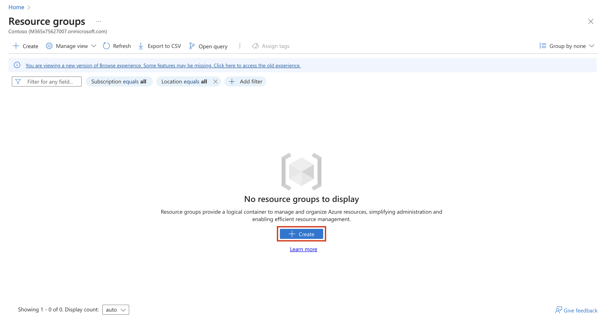

# Lab Setup

To use Microsoft Syntex pay-as-you go, you need:

- An Azure subscription in the same tenant as Microsoft Syntex

- An Azure resource group in that subscription

- You must be a [SharePoint
  Administrator](https://learn.microsoft.com/en-us/entra/identity/role-based-access-control/permissions-reference#sharepoint-administrator) or [Global
  Administrator](https://learn.microsoft.com/en-us/entra/identity/role-based-access-control/permissions-reference#global-administrator) to
  be able to access the Microsoft 365 admin center and set up Syntex.

- You must have owner or contributor rights to the Azure subscription
  that you want to use for Microsoft Syntex billing

The resources are provided in your lab environment, which will include
the following

- Administrative Credentials with Global Administrator permissions and
  necessary licenses

- Azure Promo Code

- The tenant name will be the suffix after **@** in your admin
  credentials.

- The alphanumeric code in your tenant enclosed between **@** and
  **.onmicrosoft.com** is your tenant prefix.

## Exercise 1: Configuring prerequisites for Syntex in Microsoft 365

### Task 1: Redeeming an Azure Pass

#### Redeeming a Microsoft Azure Pass Promo Code

1.  Open a new In-Private Browser session and navigate to:
    \`\`\`https://www.microsoftazurepass.com\`\`\`. Select
    the **Start** button to get started.

> 

2.  Enter your **Office 365 admin credentials** and select **Sign In**.
    Click **Confirm Microsoft Account** if the correct email address is
    listed.

> 

3.  Enter your **Azure Pass** promo code in the **Enter Promo code**
    box, enter the captcha and select **Submit**.

> 

4.  It may take up to 5 minutes to process the redemption.

> 

#### Activate your subscription

1.  When the redemption process is completed, it will redirect to the
    sign up page.

2.  Enter your account information and click **Sign up**.

    - **Country/Region**: United States

    - **First Name**: \`\`\`MOD\`\`\`

    - **Last Name**: \`\`\`Administrater\`\`\`

    - **Phone**: \`\`\`(987) 654-3210\`\`\`

    - **Address line 1**: \`\`\`One Microsoft Way\`\`\`

    - **City**: Redmond

    - **State**: Washington

    - **ZIP Code**: \`\`\`98052\`\`\`

    - Agree to the subscription agreement and offer details.

3.  It may take a few minutes to process the request.

4.  You will be asked to enable multi-factor authentication. Once you
    download Microsoft Authenticator on your mobile device, follow the
    on-screen instructions to set up the authentication.

> 

5.  Your Azure subscription is ready to be used.

6.  On the Azure home page select **Resource groups** from the left
    panel.

> 

7.  Select **Create**.

> 

8.  On the **Create a resource group** page, enter
    \`\`\`Syntex-Billing\`\`\`.

> 

9.  Then select **Review + Create**. Then select **Create**.

> 

### Task 2: Configuring Microsoft Syntex billing

1.  Open a new tab and navigate to
    \`\`\`https://admin.microsoft.com/\`\`\`, and log in using the
    administrator credentials. Select **Setup**, and then view
    the **Files and content** section. Then select **Use content AI with
    Microsoft Syntex**.

> 

2.  Select **Go to Syntex Settings**.

> 

3.  On the **Microsoft Syntex** page, select **Set up pay-as-you-go
    billing**.

> 

4.  On the **On the Microsoft Syntex page, select Set up pay-as-you-go
    billing** panel, under step 2, Set up billing, choose **Azure Pass
    Sponsorship** from the **Azure subscription** dropdown.

5.  Choose the resource group ‘**Syntex-Billing**’ and ‘**East US**’ as
    region. (The region determines where your tenant ID and usage
    information such as site names will be stored.)

6.  Read and accept the Microsoft Syntex pay-as-you-go terms of service.

7.  Select **Save**.

> 

8.  Close the pane once the settings are saved.

Stay on the same page and continue to the next Lab.

## Exercise 2: Set up a default Power Platform environment

Your tenant comes with a default Power Platform environment. To make the
default environment ready for to use with Microsoft Syntex, follow these
steps:

1.  Sign in to
    the \`\`\`https://admin.powerplatform.microsoft.com/\`\`\` as a
    Global Administrator, a Power Platform Administrator, or a Dynamics
    365 Administrator.

&nbsp;

5.  From the navigation select **Environments**.

> 

6.  In the **Dataverse** column, verify that the value is **Yes**.

- If the value is **No**, add Dataverse to the environment:

&nbsp;

- On the command bar, select **Add Dataverse** and then confirm the
  action.

- Refresh the page until the **State** column is **Ready.**

&nbsp;

- If the value is **Yes**, go to the next step.

> 

7.  On the command bar, select **Membership**.

> 

8.  On the **System Administrators** panel, select **Add me**, and then
    select **Close**.

> 

9.  On the command bar, select **Resources** \> **Dynamics 365 apps**.
    The Dynamics 365 apps page for the default environment opens.

> 

10. Verify that the **AI Builder for Project Cortex** app is installed.

- If **AI Builder for Project Cortex** isn't on the installed apps list,
  on the command bar, select **Install app**.

- If **AI Builder for Project Cortex** is already on the installed apps
  list and the **Status** column shows **Installed**, the remaining
  steps can be skipped.

- If **AI Builder for Project Cortex** is on the installed apps list,
  but the **Status** column shows **Installation failed**, then select
  the status text to view the error details. On the **Error
  details** panel, select **Retry installation**.

> 
>
> 

11. On the **Install Dynamic 365 app** panel, select **AI Builder for
    Project Cortex**, and then select **Next**.

12. On the **Install AI Builder for Project Cortex** panel, agree to the
    terms of service, and then select **Install**.

13. Wait for the app to install, and then refresh the page until
    the **Status** column shows **Installed**.

Congratulations! You have successfully setup Microsoft Syntax
prerequisites for the upcoming Labs.
